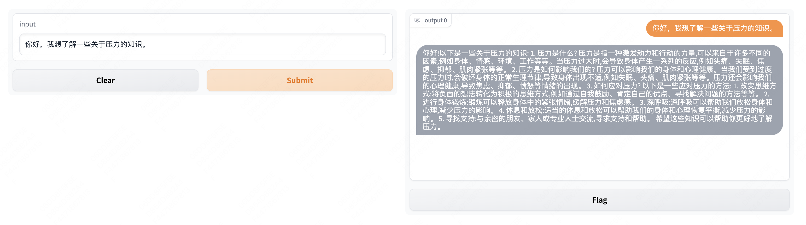
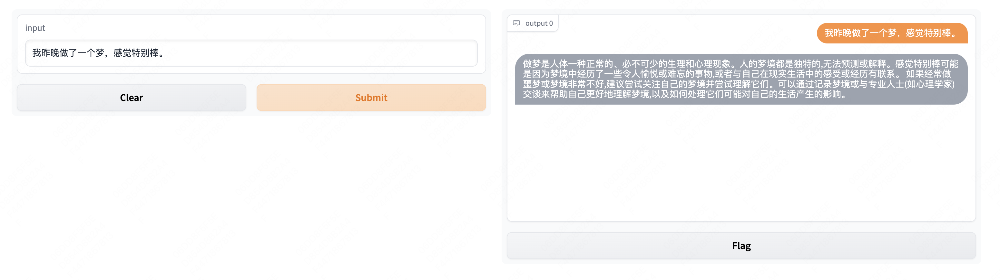
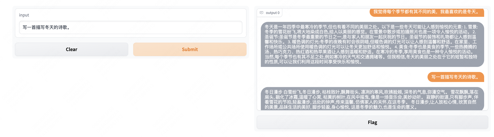

<p align="center">
     
     <br/>
</p> 

# MLE-LLaMA: Multi-Language Enhanced LLaMA

This project aims to make LLaMa understand Chinese, and can generate fluency chinese. We are inspired that LLaMa have learned good English expression and a little alignment prompt can makes it capture Chinese. 

- [X] Token vocabulary support for multi-language. We found that llama tokenizer naturally support for Chinese. 
- [X] Fine-tuning llama script.  

  (1) download original ckpt from [huggingface](https://huggingface.co/decapoda-research/llama-7b-hf), and put them into file path ```ckpt```. 

  (2) ```train.py``` original script must be run on 80G A100 and more techniques should be employed. 
  
  (3) ```train_lora.py``` lora fine-tuning using [pert](https://github.com/huggingface/peft). 
  
  | Argument | Values |
  |------|------|
  | `batch size` | 128 * 8 |
   | `epochs` | 3 |
   | `cut length` | 256 |
   | `learning rate` | 2e-5 |
   | `speed` | 1.02s / it | 
  
  
- [X] Fine-grained english-chinese alignment dataset. We colleced the high-quality English-Chinese pairs and can be download in [google drive](https://drive.google.com/file/d/1oQJQ6AOppzotlNy4a0zHAUHiXfS-GFYi/view?usp=share_link). 

     We also found that [BELLE](https://github.com/LianjiaTech/BELLE) provide ckpts and chinese dataset, strongly recommended to refer it. 

- [X] Instructing tuning. We use [chinese alpaca](https://github.com/carbonz0/alpaca-chinese-dataset) and [GuanacoDataset
](https://huggingface.co/datasets/JosephusCheung/GuanacoDataset) for instructing tunning. 
- [X] Open source [checkpoints](https://huggingface.co/feizhengcong/MLE-LLaMA/blob/main/README.md), gradio scripts and cases. 
     We found that LLaMA model tends to generate long sentences. 

<p align="center">
     
     <br/>
</p> 

<p align="center">
     
     <br/>
</p> 

<p align="center">
     
     <br/>
</p> 


## Reference 
[1] https://github.com/facebookresearch/llama 

[2] https://github.com/tatsu-lab/stanford_alpaca 

[3] https://github.com/huggingface/transformers/tree/main/examples/pytorch/language-modeling

[4] https://github.com/tloen/alpaca-lora

[5] https://github.com/LianjiaTech/BELLE 

